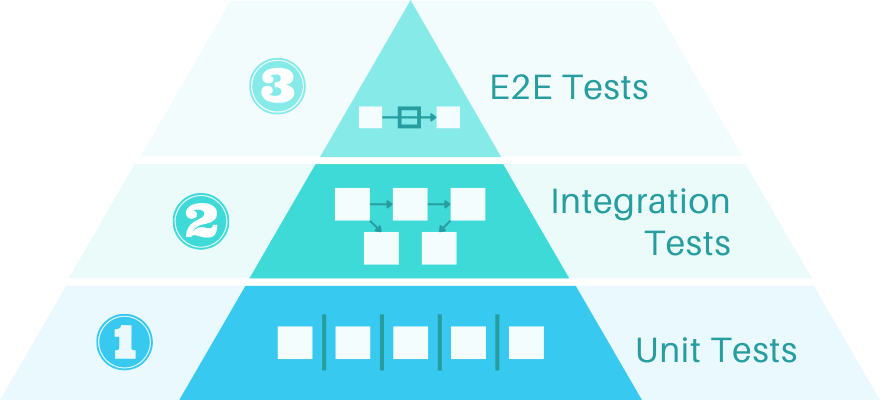

# Kas yra testavimas?

Testavimas – tai procesas, skirtas **patikrinti, ar kažkas veikia taip, kaip numatyta**.

| **Rankinis testavimas**            | **Automatizuotas testavimas**        |
|------------------------------------|--------------------------------------|
| Varginantis ir sudėtingas          | Reikia pradinės pastangos (testų rašymas), po to nereikia papildomų veiksmų |
| Linkęs į klaidas                   | Prognozuojamas ir nuoseklus          |
| Dažnai neužbaigtas (neapima visų scenarijų) | Gali pasiekti didelę ar visišką kodo ir scenarijų aprėptį |

---

## Kas yra Unit testai?

**Unit** – programos sudedamoji dalis.  
Idealiu atveju – **mažiausia galima programos dalis**.

Pavyzdžiai:

- Funkcija
- Klasė
- Komponentas

**Programa (Application)** – tai visų vienetų kombinacija.

> Jei visi vienetai yra ištestuoti, bendra programa taip pat turėtų veikti tinkamai.  
> Tai papildomai užtikrinama integraciniais testais.

**Kodo pakeitimai** visada testuojami prieš visus vienetus, kad būtų išvengta klaidų.

---

## Kodėl verta rašyti unit testus?

- Vengiate begalinio kiekio **rankinių testų**.  
- Leidžia pasiekti beveik **100% kodo ir scenarijų aprėptį**.  
- Kodo pakeitimai testuojami **akimirksniu** prieš visus scenarijus.  
- Skatina rašyti **švaresnį ir geresnį kodą**, nes testuoti tampa lengviau.

---

## Unit, integracinis ir „End-to-End“ (E2E) testavimas

| **Unit** | **Integracinis testavimas** | **E2E testavimas** |
|---------------------------|------------------------------|--------------------|
| Testuojamos **atskiros programos dalys (vienetai)**. | Testuojama, **kaip vienetai veikia kartu**. | Testuojami **pilni procesai ir funkcijos**, kaip jas naudotų realūs vartotojai. |
| Kiekvienas vienetas tikrinamas **atskirai**. | Užtikrinama, kad **kombinacija** veiktų tinkamai. | Vartotojai naudojasi funkcijomis, **ne atskirais vienetais**. |
| Jei visi vienetai veikia – visa programa turėtų veikti. | Net jei vienetai veikia atskirai, jų kombinacija gali sugesti. | Užtikrina realaus pasaulio veikimą. |

---

## Unit, integracinis ir E2E testavimas – palyginimas

| **Unit testavimas** | **Integracinis testavimas** | **E2E testavimas** |
|---------------------------|------------------------------|--------------------|
| Greitai randa ir **nurodo klaidos vietą**. | Tikrina **procesų dalis ir vienetų kombinacijas**. | Testuoja **realius vartotojų veiksmus ir elgesį**. |
| **Nepaiso** tikrų vartotojų procesų ir sąveikų. | Sudėtinga tiksliai nustatyti **klaidos priežastį**. | Labai sunku pasiekti **visų elgsenų aprėptį**. |

> **Rekomendacija:** Naudokite visų tipų testų derinį!

---

## Testavimo piramidė

- Daugiausia – unit testų.
- Vidutinė dalis – integracinių testų.
- Mažiausia dalis – E2E testų.

